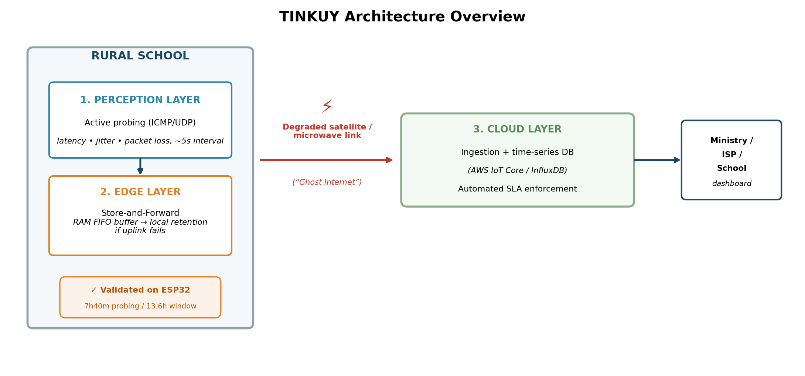

# TINKUY

**An IoT Edge-Computing Architecture for Auditing Connectivity Quality and Combating "Ghost Internet" in Rural Schools**

Submitted to the **2026 IEEE ComSoc "Communications Technology Changing the World" Student Competition**.

> TINKUY (Quechua: "encounter" / "meeting point") audits the *real* quality of internet service delivered to rural schools — not just whether a link is nominally "up", and preserves evidence of degradation even when the connection itself fails.

## The problem: "Ghost Internet"

Many rural schools are officially reported as "connected," yet in practice the connection is too degraded (high latency, packet loss) to actually support a video class, an online exam, or a digital library. Traditional centralized monitoring (e.g., a ping from a ministry's office) fails precisely when the network degrades, because the very data that would prove the degradation is also lost along the way.

## What's in this repository

This repo contains the **actual code used to build and field-test the first TINKUY prototype**, referenced in the IEEE ComSoc Student Competition submission.

```
tinkuy-repo/
├── firmware/
│   └── tinkuy_esp32_storeforward.ino   # ESP32 firmware (Perception + minimal Edge layer)
├── server/
│   └── tinkuy_server.py                # Flask server simulating the Cloud ingestion endpoint
├── tools/
│   └── tinkuy_serial_logger.py         # Python/pyserial logger for local CSV telemetry capture
├── data/
│   └── tinkuy_cloud_received.csv       # Real telemetry: 13.6h of continuous field testing
└── docs/
    ├── figure_architecture_layers.png  # 3-layer architecture diagram
    ├── figure1_topology.png            # Cisco Packet Tracer topology (illustrative)
    └── figure_latency_plr_comparison.png  # Latency/PLR comparison chart (real data)
```

## Architecture

TINKUY is designed around three layers:

1. **Perception Layer** — active probing (ICMP), measuring latency and packet loss every 5 seconds.
2. **Edge Layer** — Store-and-Forward: readings that fail to reach the cloud are retained locally (RAM ring buffer) instead of discarded, and synchronized as a batch once connectivity is restored.
3. **Cloud Layer** *(target design, not yet implemented)* — ingestion, time-series storage, and automated SLA-violation detection.

This first prototype (`firmware/`) validates layers 1 and a minimal version of layer 2, running on an ESP32 microcontroller — well below the target Raspberry Pi/Docker/MQTT-QoS2 architecture described in the full submission, but enough to demonstrate the core principle in real hardware.



## Hardware / software used

- **Board:** ESP32 Dev Module (generic)
- **Firmware:** Arduino IDE (C/C++), [ESP32Ping](https://github.com/marian-craciunescu/ESP32Ping) library
- **Cloud simulator:** Python 3 + Flask (`server/tinkuy_server.py`)
- **Local logger:** Python 3 + [pyserial](https://pypi.org/project/pyserial/) (`tools/tinkuy_serial_logger.py`)

## Running it yourself

1. Flash `firmware/tinkuy_esp32_storeforward.ino` to an ESP32 (set your WiFi SSID/password and your server's local IP inside the sketch).
2. Start the cloud simulator on your machine:
   ```
   pip install flask
   python server/tinkuy_server.py
   ```
3. (Optional) In a separate terminal, run the local logger to also capture a CSV over serial:
   ```
   pip install pyserial
   python tools/tinkuy_serial_logger.py
   ```
4. Data received by the server is saved to `tinkuy_cloud_received.csv`; a sample from the actual 13.6-hour field test is included in `data/`.

## Field-test results (summary)

| Environment | Duration | Avg. latency | PLR |
|---|---|---|---|
| Home (fixed 2.4GHz WiFi) | ~5h 54min | 36.4 ms | 0.99% |
| University campus (mobile hotspot) | ~1h 46min | 167.5 ms | 5.68% |

A total connectivity outage was also deliberately induced (MAC filtering at the access point) for ~7.5 minutes; the 70 readings taken during that window were retained locally and synchronized as a single batch upon reconnection, confirming the Store-and-Forward mechanism.

## Author

**Lucia Gil Vivanco** - IEEE ComSoc Student Member
Pontificia Universidad Católica del Perú (PUCP)
a20233424@pucp.edu.pe

## Status

This is an active early-stage research/competition prototype, not production software. Contributions, issues, and forks are welcome.
